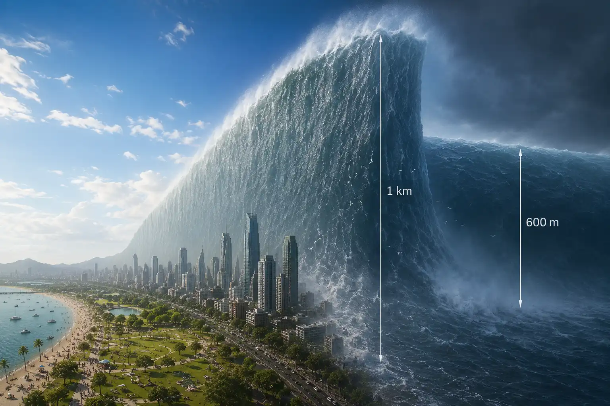

render an image of an 1km high flood wave, flooding a large city with tall buildings (skyscrapers around 500m high). the image should capture the flood wave in its full height, so the city (and the humans living in the city) look small, almost invisible. the flood wave should be visible from the side, so on the one side of the image, there is the intact world before the flood wave (with sunshine and happy people), and on the other side of the image there is the 1km high flood wave, followed by a body of water at a slightly lower height, maybe 600m high

---

ChatGPT:

