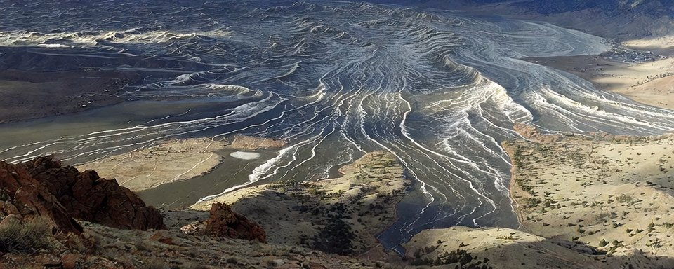

# High resolution simulation of Ben Davidson's pole shift theory

With the modeling nearing completion in my simulation software, I am increasing the compute power on these TPW simulations. Currently, I have three active tiers of compute with a fourth in development.

- Tier 1: 0.5° with 55,000 cube cells globally
- Tier 2: 0.1° with 1,400,000 cube cells globally
- Tier 3: 0.05° with 5,500,000 cube cells globally
- Tier 4: 0.01° with 138,000,000 cube cells globally (in development)

Today's simulation of [@SunWeatherMan](https://x.com/@SunWeatherMan)'s pole shift theory was run overnight at Tier 3 zoom levels. This increases the zoom enough to really hone in accuracy around narrow valley's and smaller mountain ranges.

Even so, I don't expect full spectrum accuracy confidence until I can run a Tier 4 event. Those simulations will likely need days, if not weeks, to run on my equipment. I can't wait to have a test environment for those.

Anyway, let's get into each of the simulation views for Ben's pole shift theory.

## Earth Orbital View

As the pole rapidly shifts towards India, it is the northern hemisphere that gets hardest first, but few regions exit unscathed by Ben Davidson's pole shift.

<!--
<video poster="img/Earth Orbital View 0zrb9mx6sQsN7gWa.jpg" controls><source src="img/Earth Orbital View 0zrb9mx6sQsN7gWa.mp4" type="video/mp4"></video>
-->

## North America

The New Valley of the Sun from Ben Davidson's pole shift theory aligns perfectly in this simulation. Ben clearly did his homework selecting his Colorado location.

Much of the higher elevation Midwest regions also survive unscathed as the Atlantic forcing moves more northward into Canada than eastward into the heartland of the United States.

<!--
<video poster="img/North America I5X43XXs5OwG2_Q4.jpg" controls><source src="img/North America I5X43XXs5OwG2_Q4.mp4" type="video/mp4"></video>
-->

## Europe

In Europe, we predictably see an absolute coverage outside of just the highest mountain ranges on the continent. The low level elevations are unkind to anyone who lives there. This higher tier resolution accurately shows the mountain peaks do survive through the equatorial plane.

<!--
<video poster="img/Europe TGylwFxB3n8xIZPc.jpg" controls><source src="img/Europe TGylwFxB3n8xIZPc.mp4" type="video/mp4"></video>
-->

## Africa

One of the key pieces of evidence in The Ethical Skeptic's ECDO theory is that erosion at the peak of Khafre Pyramid in Giza. In my early simulations of that the ECDO theory show the correct water height for that location, however, we also see similar inundation levels at the same location for Ben Davidson's pole shift theory as well.

I found it quite interesting that two competing theories are showing confluence at a critical evidence point.

<!--
<video poster="img/Africa KVEqWGReQw17FaNT.jpg" controls><source src="img/Africa KVEqWGReQw17FaNT.mp4" type="video/mp4"></video>
-->

## Asia

Asia escapes the brunt of inundation, but will freeze over being the new north pole region. Given the height of the Himalayas, we should expect massive ice age conditions across much of the continent that remaining dry during Ben Davidson's pole shift.

<!--
<video poster="img/Asia MtH0FcHc-HSnB6UI.jpg" controls><source src="img/Asia MtH0FcHc-HSnB6UI.mp4" type="video/mp4"></video>
-->

## Oceania

The higher tier resolution does help the Australian question. Some peaks do survive here despite being on the east coast of the continent. Also parts of the inner continent escape the slosh back during the shift event. Overall, I think I'd rather Ben Davidson's pole shift to be the one that triggers over ECDO due to the less amount of forcing seen at these coordinates.

<!--
<video poster="img/Oceania sQIlp3shujOXfbIq.jpg" controls><source src="img/Oceania sQIlp3shujOXfbIq.mp4" type="video/mp4"></video>
-->

## South America

And finally, we have South America. The forcing really hits hard on the east coast and hammers the lower elevations there, but a sizable chunk of the continent escapes without inundation reaching it. That central western region looks pretty safe.

<!--
<video poster="img/South America Dfdj2xva2MkQsze_.jpg" controls><source src="img/South America Dfdj2xva2MkQsze_.mp4" type="video/mp4"></video>
-->

---

In Ben Davidson's pole shift, he accurately identified parts of Mongolia and his New Valley of the Sun in Colorado as safer regions. Those were not the only safe places in this pole shift, however, but with his audience mostly US-based that is where he tends to focus his attention.

Surprisingly, Australia found some grace here with the higher zoom added to the simulation. It shows the eastern mountain range could potentially be a safe spot as is the interior of the continent - though I'd still plan to float away just in case the simulation is off or the timeframe (24 hours) is also wrong on these simulations.

There are still too many unknowns when running these simulations, but its still a good exercise to run in my opinion. I definitely recommend joining the [Solar Killshot forum](https://solarkillshot.org/) as that community is pretty involved in this topic.

---

6:36 PM · May 26, 2026 · 846.7K Views

archived from https://x.com/HashZappa/status/2059312764448051555 on 2026-06-06
